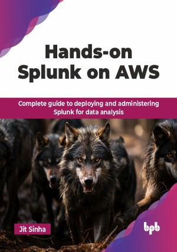

# Hands-on Splunk on AWS

Complete guide to deploying and administering Splunk for data analysis.

This is the repository for [Hands-on Splunk on AWS
](https://bpbonline.com/products/hands-on-splunk-on-aws?variant=44322264088776),published by BPB Publications.

## About the Book
Hands-on Splunk on AWS is a practical tutorial for professionals who wish to set up, manage, and analyze data with Splunk on AWS. This practical guide capitalizes on the scalability and flexibility of Amazon Web Services (AWS) to streamline your Splunk deployment.

This book is a complete guide to Splunk, a powerful tool for analyzing and visualizing machine-generated data. It explains Splunk’s architecture, components, and data flow, helping you set up, configure, and index data effectively. Learn to write efficient Splunk Processing Language (SPL) queries, create detailed visualizations, and optimize searches for deeper insights. Discover advanced topics like clustering and integrating Splunk into modern DevOps practices and cloud-native environments. The book also shares best practices for administration, troubleshooting, and security.

By the end of this guide, readers will be confident in utilizing Splunk on AWS to make data-driven decisions. Whether you want to improve your data analysis or use AWS for Splunk, this book will teach you the skills and insights you need in today's data-driven world.

## What You Will Learn
• How to deploy and configure Splunk effectively on AWS.

• Key concepts and tools in data onboarding and indexing.

• Mastery of the Splunk Processing Language (SPL) for data queries.

• Techniques for creating and managing interactive dashboards.

• Integration of Splunk with Kubernetes and CI/CD pipelines.

• Methods for applying machine learning in data analysis with Splunk.
